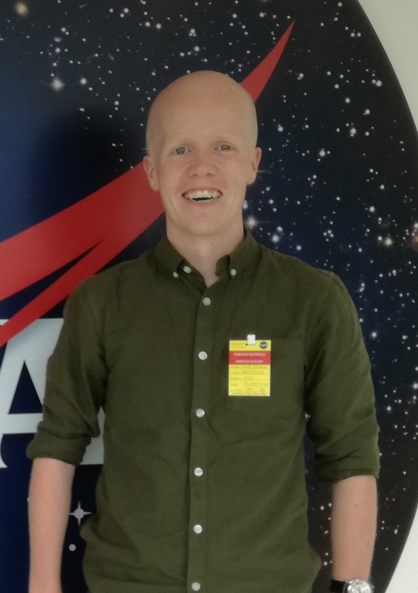

<html>
<!--

-->
<head>
<link rel="stylesheet" href="main.css">
<link rel="icon" type="image/png" href="./pdfs/favicon.png">
<!--  <title>Dr James A. G. Jackman</title> -->
</head>
<body style="background-color:#FFFFFF;">
<a href="mailto:jamesjackman@asu.edu"><h4>Email</h4></a> &nbsp;  &nbsp; <a href="https://ui.adsabs.harvard.edu/public-libraries/NAGvqs9vTkeTitoqIK-sMg"><h4>Publications</h4></a> &nbsp; &nbsp; <a href="./pdfs/James_Jackman_Full_CV_Jun_2022.pdf"><h4>CV</h4></a> &nbsp; &nbsp; <a href="https://orcid.org/0000-0003-0711-7992"><h4>ORCID</h4></a> &nbsp; &nbsp; <a href="https://isearch.asu.edu/profile/3775785"><h4>Department Webpage</h4></a>
<!-- <h2>Dr James A. G. Jackman</h2>
<h4>jamesjackman@asu.edu</h4> -->
<!-- <header><h1>Dr James A. G. Jackman</h1></header> -->

<h2> About Me </h2>

I am a Postdoctoral Scholar in astronomy at Arizona State University and have been since August 2020. I work with Prof. Evegnya Shkolnik. I study the magnetic activity of stars ranging from those like our Sun right down to the brown dwarf boundary. 

 I'm particularly interested in stellar flares, explosive astrophysical phenomena caused by reconnection events in the magnetic fields of stars other than our Sun. Stellar flares emit radiation from radio up to X-ray wavelengths and those detected regularly have energies exceeding anything seen from the modern Sun. My work involves finding and characterising these intense events, in order to better understand how often they occur on different types of stars and the amount of energy they release in different wavelengths. This knowledge can then be applied to our understanding of the effects of flares on the habitability of exoplanets. My work has been featured in the internatonal press and I'm always happy to discuss recent findings or future ideas with the press and scientific community alike. 

  

 My email and other relevant information is avaiable in the links at the top of the page. If you have any queries about my work, future projects, or the field in general, please get in touch.

<a href="https://twitter.com/JackmanJames26"><h4>Twitter</h4></a> &nbsp; &nbsp; <a href="./pdfs/equation.pdf"><h4>Flare Model</h4></a>

<!--

<a href="mailto:jamesjackman@asu.edu"><h4>Email</h4></a> <a href="https://twitter.com/JackmanJames26"><h4>Twitter</h4></a>

-->
</body>
</html>
